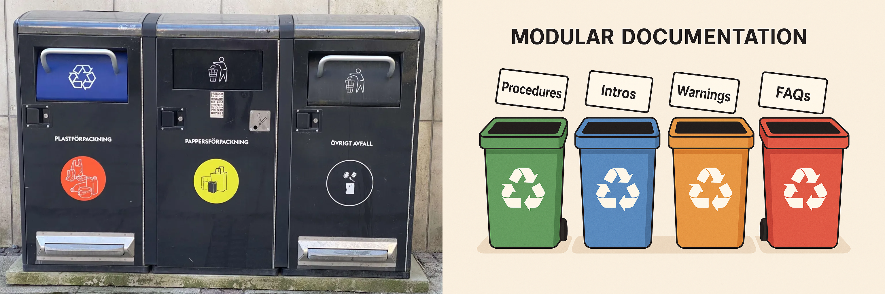

- [Jyoti Sethi Khullar](#jyoti-sethi-khullar)
- [PROFILE](#profile)
- [Highlights:](#highlights)
- [SKILLS AND TOOLS](#skills-and-tools)

# Jyoti Sethi Khullar
Senior Technical Writer | Documentation Strategist | AI-Empowered Content Leader | Based in Sweden
+46 72 350 25 67 | [Email](mailto:jyotisethikhullar@gmail.com) | [Website](https://jskwrites.com/) | [LinkedIn](https://www.linkedin.com/in/jskwrites/) | [Quora](https://www.quora.com/profile/Jyoti-Sethi-Khullar-2)

# PROFILE
Senior Technical Writer and Documentation Strategist with 19+ years of experience delivering scalable, **user-focused content** for global teams. Specialized in ***developer docs***, *multilingual workflows*, and AI-assisted documentation. Known for building content standards, training writing teams, and modernizing legacy documentation with clarity, structure, and forward-thinking. Now based in Sweden and open to remote or hybrid roles across Europe.

# Highlights: 
* Led a team of technical writers and translators to produce comprehensive bilingual developer guides, user manuals, and release notes, enhancing product understanding and user satisfaction.
  * Leverage AI-driven tools to streamline research, editing, and revamp processes, reducing production time by 30%.
    * Developed and maintained documentation standards and best practices, reducing SME reverts and feedback comments by 25%.

1.  Collaborated with cross-functional teams, including engineering, product management, and customer support, to gather information, bridge gaps, and ensure accurate and up-to-date documentation, reducing the customer support queries by 30%.   
    a. yuyuyu  
    b. hhkhkhk   
    c. ghghgh
   

     > Conducted training sessions and workshops on technical writing topics to promote continuous learning for corporate technical writer teams.

# SKILLS AND TOOLS

Core competencies | Tools 
---- | ---- 
Technical Writing | Help Studio
Editing | Confluence 
Documentation strategy | Jira

Core competencies | Technical Writing · Editing · Documentation Strategy · Developer Documentation · Content Revamp and Modernization · Style Guides · AI-Assisted Workflows · Multilingual Documentation (EN–JP) · Training & Mentorship · Cross-Functional Collaboration · Globalization · Doc-as-Code | 
---- | ---- 
Tools | MadCap Flare · Help Studio · Confluence · Jira · SharePoint · Git · Markdown · HTML · WordPress · ChatGPT · Grammarly · DeepL · Canva · MS Office

 

